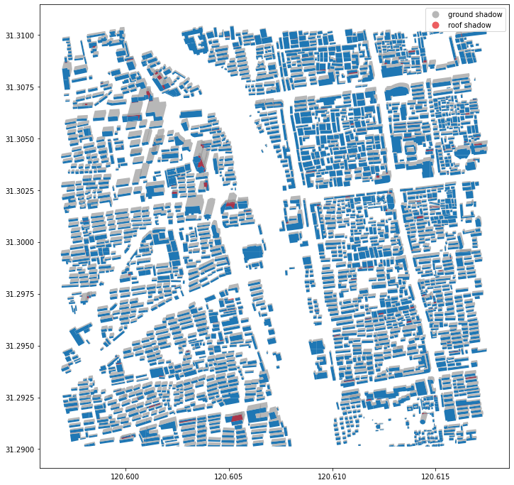
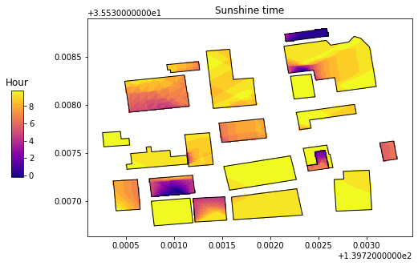
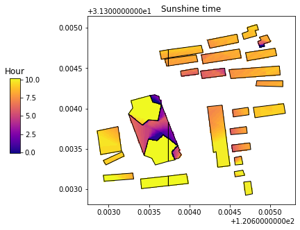
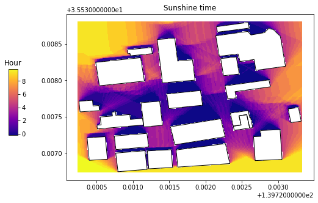
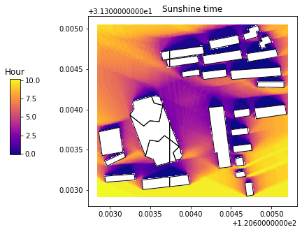

# pybdshadow


[](https://pybdshadow.readthedocs.io/en/latest/?badge=latest) [](https://pepy.tech/project/pybdshadow) [](https://codecov.io/gh/ni1o1/pybdshadow) [](https://github.com/ni1o1/pybdshadow/actions/workflows/tests.yml) [](https://mybinder.org/v2/gh/ni1o1/pybdshadow/3d7f14d9db7fe2060e18e12935021ee9df4e1d5d?urlpath=lab%2Ftree%2Fexample%2FExample1-building_shadow_analysis.ipynb)

## Introduction

`pybdshadow` is a python package for generating, analyzing and visualizing building shadows from large scale building geographic data. `pybdshadow` support generate building shadows from both sun light and point light. `pybdshadow` provides an efficient and easy-to-use method to generate a new source of geospatial data with great application potential in urban study.

The latest stable release of the software can be installed via pip and full documentation can be found [here](https://pybdshadow.readthedocs.io/en/latest/).

## Functionality

Currently, `pybdshadow` mainly provides the following methods:

- *Generating building shadow from sun light*: With given location and time, the function in `pybdshadow` uses the properties of sun position obtained from [`suncalc-py`](https://github.com/kylebarron/suncalc-py) and the building height to generate shadow geometry data.
- *Generating building shadow from point light*: `pybdshadow` can generate the building shadow with given location and height of the point light, which can be potentially useful for visual area analysis in urban environment.
- *Analysis*: `pybdshadow` integrated the analysing method based on the properties of sun movement to track the changing position of shadows within a fixed time interval. Based on the grid processing framework provided by [`TransBigData`](https://github.com/ni1o1/transbigdata), `pybdshadow` is capable of calculating sunshine time on the ground and on the roof.
- *Visualization*: Built-in visualization capabilities leverage the visualization package `keplergl` to interactively visualize building and shadow data in Jupyter notebooks with simple code.

The target audience of `pybdshadow` includes data science researchers and data engineers in the field of BIM, GIS, energy, environment, and urban computing.

## Installation

It is recommended to use `Python 3.7, 3.8, 3.9`

### Using pypi [](https://badge.fury.io/py/pybdshadow)

`pybdshadow` can be installed by using `pip install`. Before installing `pybdshadow`, make sure that you have installed the available [geopandas package](https://geopandas.org/en/stable/getting_started/install.html). If you already have geopandas installed, run the following code directly from the command prompt to install `pybdshadow`:

```python
pip install pybdshadow
```

## Usage

### Shadow generated by Sun light

Detail usage can be found in [this example](https://github.com/ni1o1/pybdshadow/blob/main/example/Example1-building_shadow_analysis.ipynb).
`pybdshadow` is capable of generating shadows from building geographic data.
The buildings are usually store in the data as the form of Polygon object with `height` information (usually Shapefile or GeoJSON file).

```python
import pandas as pd
import geopandas as gpd
#Read building GeoJSON data
buildings = gpd.read_file(r'data/bd_demo_2.json')
```

Given a building GeoDataFrame and UTC datetime, `pybdshadow` can calculate the building shadow based on the sun position obtained by `suncalc-py`.

```python
import pybdshadow
#Given UTC datetime
date = pd.to_datetime('2022-01-01 12:45:33.959797119')\
    .tz_localize('Asia/Shanghai')\
    .tz_convert('UTC')
#Calculate building shadow for sun light
shadows = pybdshadow.bdshadow_sunlight(buildings,date)
```

Visualize buildings and shadows using matplotlib.

```python
import matplotlib.pyplot as plt
fig = plt.figure(1, (12, 12))
ax = plt.subplot(111)
# plot buildings
buildings.plot(ax=ax)
# plot shadows
shadows['type'] += ' shadow'
shadows.plot(ax=ax, alpha=0.7,
             column='type',
             categorical=True,
             cmap='Set1_r',
             legend=True)
plt.show()
```



`pybdshadow` also provide visualization method supported by keplergl.

```python
# visualize buildings and shadows
pybdshadow.show_bdshadow(buildings = buildings,shadows = shadows)
```


### Shadow generated by Point light

`pybdshadow` can also calculate the building shadow generated by point light. Given coordinates and height of the point light:

```python
#Calculate building shadow for point light
shadows = pybdshadow.bdshadow_pointlight(buildings,139.713319,35.552040,200)
#Visualize buildings and shadows
pybdshadow.show_bdshadow(buildings = buildings,shadows = shadows)
```


### Shadow coverage analysis

`pybdshadow` provides the functionality to analysis sunshine time on the roof and on the ground.

Result of shadow coverage on the roof:



Result of sunshine time on the ground:



## Dependency

`pybdshadow` depends on the following packages

* `numpy`
* `pandas`
* `shapely`
* `rtree`
* `geopandas`
* `matplotlib`
* [`suncalc`](https://github.com/kylebarron/suncalc-py)
* [`keplergl`](https://kepler.gl/)
* [`TransBigData`](https://github.com/ni1o1/transbigdata)

## Citation information

Citation information can be found at [CITATION.cff](https://github.com/ni1o1/pybdshadow/blob/main/CITATION.cff).

## Contributing to pybdshadow [](https://github.com/ni1o1/pybdshadow/graphs/contributors) 

All contributions, bug reports, bug fixes, documentation improvements, enhancements and ideas are welcome. A detailed overview on how to contribute can be found in the [contributing guide](https://github.com/ni1o1/pybdshadow/blob/master/CONTRIBUTING.md) on GitHub.
