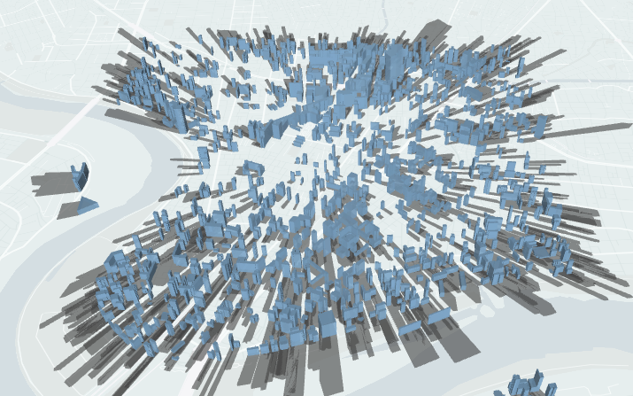
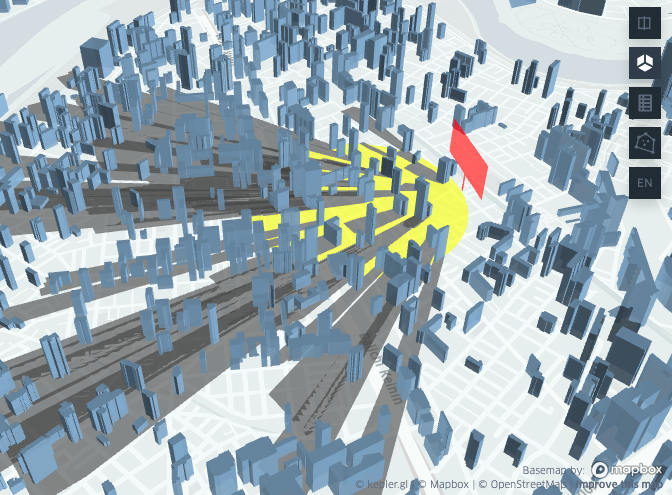

# pybdshadow


[](https://pybdshadow.readthedocs.io/en/latest/?badge=latest) [](https://pepy.tech/project/pybdshadow) [](https://codecov.io/gh/ni1o1/pybdshadow) [](https://github.com/ni1o1/pybdshadow/actions/workflows/tests.yml)

## Introduction

`pybdshadow` is a python package to generate building shadow geometry. The latest stable release of the software can be installed via pip and full documentation can be found [here](https://pybdshadow.readthedocs.io/en/latest/).

## Example

### Shadow generated by Sun light

Given a building GeoDataFrame and UTC datetime, `pybdshadow` can calculate the building shadow based on the sun position obtained by `suncalc`

```python
import pybdshadow
#Given UTC datetime
date = pd.to_datetime('2015-01-01 02:45:33.959797119')
#Calculate building shadow for sun light
shadows = pybdshadow.bdshadow_sunlight(buildings,date)
```

`pybdshadow` also provide visualization method supported by keplergl.

```python
# visualize buildings and shadows
pybdshadow.show_bdshadow(buildings = buildings,shadows = shadows)
```


Detail usage can be found in [this example](https://github.com/ni1o1/pybdshadow/blob/main/example/example.ipynb).

### Shadow generated by Point light

`pybdshadow` can also calculate the building shadow generated by point light. Given coordinates and height of the point light:

```python
#Calculate building shadow for point light
shadows = pybdshadow.bdshadow_pointlight(buildings,139.713319,35.552040,200)
#Visualize buildings and shadows
pybdshadow.show_bdshadow(buildings = buildings,shadows = shadows)
```



### Billboard visual area analyze

To analyze billboard visual area, the parameter `ad_params` for the billboard should be defined. It has two forms:

```python
#1. Given the coordinates of brandCenter, orientation and height
ad_params = {'orientation': 1.2806657381630058,
            'height': 10,
            'brandCenter': [139.71259, 35.552842999999996]} 
#2. Given the coordinates of the two border points and height
ad_params = {'point1': [139.711861, 35.552040],
            'point2': [139.713319, 35.553646],#1861,3646
            'height': 50,
            }
```

We can calculate the visual area of the billboard using `ad_visualArea`.

```python
#calculate the visual area
visualArea,shadows = pybdshadow.ad_visualArea(ad_params,buildings)
```

Then, visualize the billboard and the visual area.

```python
#Generate a GeoDataFrame from ad_params for visualization
billboard_gdf = pybdshadow.ad_to_gdf(ad_params,billboard_height = 100)
#Visualize buildings, shadows, billboard and visual area
pybdshadow.show_bdshadow(buildings=buildings,
                         shadows=shadows,
                         ad=billboard_gdf,
                         ad_visualArea=visualArea)
```



## Installation

It is recommended to use `Python 3.7, 3.8, 3.9`

### Using pypi [](https://badge.fury.io/py/pybdshadow)

`pybdshadow` can be installed by using `pip install`. Before installing `pybdshadow`, make sure that you have installed the available [geopandas package](https://geopandas.org/en/stable/getting_started/install.html). If you already have geopandas installed, run the following code directly from the command prompt to install `pybdshadow`:

```python
pip install pybdshadow
```

## Dependency

`pybdshadow` depends on the following packages

* `numpy`
* `pandas`
* `shapely`
* `rtree`
* `geopandas`
* `matplotlib`
* [`suncalc`](https://github.com/kylebarron/suncalc-py)
* `keplergl`

## Citation information

Citation information can be found at [CITATION.cff](https://github.com/ni1o1/pybdshadow/blob/main/CITATION.cff).

## Contributing to pybdshadow [](https://github.com/ni1o1/pybdshadow/graphs/contributors) 

All contributions, bug reports, bug fixes, documentation improvements, enhancements and ideas are welcome. A detailed overview on how to contribute can be found in the [contributing guide](https://github.com/ni1o1/pybdshadow/blob/master/CONTRIBUTING.md) on GitHub.
