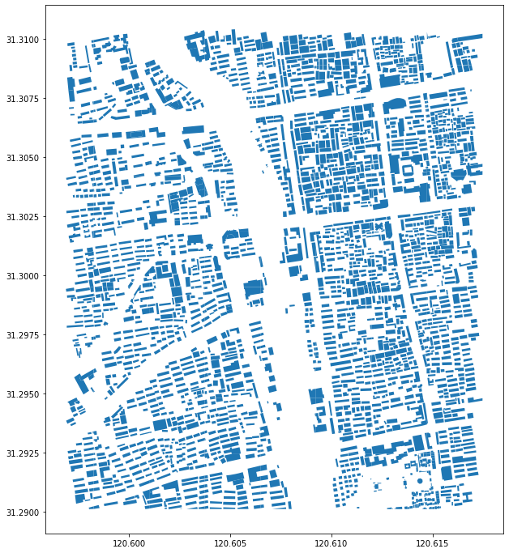
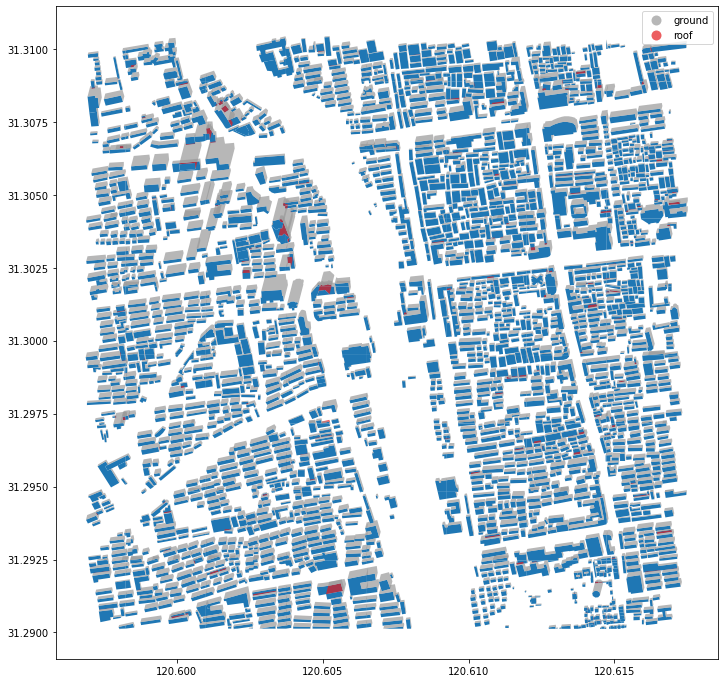
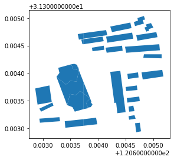
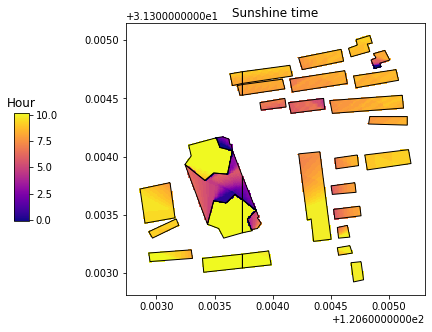
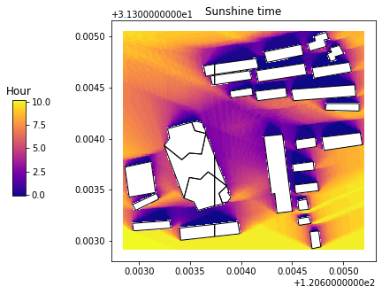
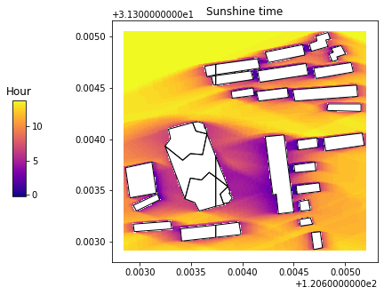

Building shadow analysis
==============================

Notebook for this example: `here <https://github.com/ni1o1/pybdshadow/blob/main/example/Example1-building_shadow_analysis.ipynb>`__.

In this example, we will introduce how to use ``pybdshadow`` to
generate, analyze and visualize the building shadow data

Building data preprocessing
-----------------------------

Building data can be obtain by Python package
`OSMnx <https://osmnx.readthedocs.io/en/stable/>`__ from OpenStreetMap
(Some of the buildings do not contain the height information).

The buildings are usually store in the data as the form of Polygon
object with ``height`` column. Here, we provide a demo building data
store as GeoJSON file to demonstrate the functionality of ``pybdshadow``

::

    import pandas as pd
    import geopandas as gpd
    import pybdshadow
    #Read building data
    buildings = gpd.read_file(r'../example/data/bd_demo_2.json')
    buildings.head(5)

.. raw:: html

    

    
    <table border="1" class="dataframe">
      <thead>
        <tr style="text-align: right;">
          <th></th>
          <th>Id</th>
          <th>Floor</th>
          <th>height</th>
          <th>x</th>
          <th>y</th>
          <th>geometry</th>
        </tr>
      </thead>
      <tbody>
        <tr>
          <th>0</th>
          <td>0</td>
          <td>2</td>
          <td>6.0</td>
          <td>120.597313</td>
          <td>31.309152</td>
          <td>POLYGON ((120.59739 31.30921, 120.59740 31.309...</td>
        </tr>
        <tr>
          <th>1</th>
          <td>0</td>
          <td>2</td>
          <td>6.0</td>
          <td>120.597276</td>
          <td>31.309312</td>
          <td>POLYGON ((120.59737 31.30938, 120.59738 31.309...</td>
        </tr>
        <tr>
          <th>2</th>
          <td>0</td>
          <td>2</td>
          <td>6.0</td>
          <td>120.597313</td>
          <td>31.308982</td>
          <td>POLYGON ((120.59741 31.30905, 120.59742 31.308...</td>
        </tr>
        <tr>
          <th>3</th>
          <td>0</td>
          <td>2</td>
          <td>6.0</td>
          <td>120.597272</td>
          <td>31.309489</td>
          <td>POLYGON ((120.59735 31.30955, 120.59736 31.309...</td>
        </tr>
        <tr>
          <th>4</th>
          <td>0</td>
          <td>2</td>
          <td>6.0</td>
          <td>120.597128</td>
          <td>31.309778</td>
          <td>POLYGON ((120.59729 31.30986, 120.59730 31.309...</td>
        </tr>
      </tbody>
    </table>
    

The input building data must be a ``GeoDataFrame`` with the ``height``
column storing the building height information and the ``geometry``
column storing the geometry polygon information of building outline.

::

    #Plot the buildings
    buildings.plot(figsize=(12,12))

Before analysing buildings, make sure to preprocess building data using
``pybdshadow.bd_preprocess`` before calculate shadow. It will remove
empty polygons, convert multipolygons into polygons and generate
``building_id`` for each building.

::

    buildings = pybdshadow.bd_preprocess(buildings)
    buildings.head(5)

.. raw:: html

    

    
    <table border="1" class="dataframe">
      <thead>
        <tr style="text-align: right;">
          <th></th>
          <th>geometry</th>
          <th>Id</th>
          <th>Floor</th>
          <th>height</th>
          <th>x</th>
          <th>y</th>
          <th>building_id</th>
        </tr>
      </thead>
      <tbody>
        <tr>
          <th>0</th>
          <td>POLYGON ((120.60496 31.29717, 120.60521 31.297...</td>
          <td>0</td>
          <td>2</td>
          <td>6.0</td>
          <td>120.604951</td>
          <td>31.297207</td>
          <td>0</td>
        </tr>
        <tr>
          <th>1</th>
          <td>POLYGON ((120.60494 31.29728, 120.60496 31.297...</td>
          <td>0</td>
          <td>2</td>
          <td>6.0</td>
          <td>120.604951</td>
          <td>31.297207</td>
          <td>1</td>
        </tr>
        <tr>
          <th>0</th>
          <td>POLYGON ((120.59739 31.30921, 120.59740 31.309...</td>
          <td>0</td>
          <td>2</td>
          <td>6.0</td>
          <td>120.597313</td>
          <td>31.309152</td>
          <td>2</td>
        </tr>
        <tr>
          <th>1</th>
          <td>POLYGON ((120.59737 31.30938, 120.59738 31.309...</td>
          <td>0</td>
          <td>2</td>
          <td>6.0</td>
          <td>120.597276</td>
          <td>31.309312</td>
          <td>3</td>
        </tr>
        <tr>
          <th>2</th>
          <td>POLYGON ((120.59741 31.30905, 120.59742 31.308...</td>
          <td>0</td>
          <td>2</td>
          <td>6.0</td>
          <td>120.597313</td>
          <td>31.308982</td>
          <td>4</td>
        </tr>
      </tbody>
    </table>
    

Generate building shadows
-----------------------------

Shadow generated by Sun light
~~~~~~~~~~~~~~~~~~~~~~~~~~~~~~~~~

Given a building GeoDataFrame and UTC datetime, ``pybdshadow`` can
calculate the building shadow based on the sun position obtained by
``suncalc``

::

    #Given UTC time
    date = pd.to_datetime('2022-01-01 12:45:33.959797119')\
        .tz_localize('Asia/Shanghai')\
        .tz_convert('UTC')
    #Calculate shadows
    shadows = pybdshadow.bdshadow_sunlight(buildings,date,roof=True,include_building = False)
    shadows

.. raw:: html

    

    
    <table border="1" class="dataframe">
      <thead>
        <tr style="text-align: right;">
          <th></th>
          <th>height</th>
          <th>building_id</th>
          <th>geometry</th>
          <th>type</th>
        </tr>
      </thead>
      <tbody>
        <tr>
          <th>0</th>
          <td>6.0</td>
          <td>186</td>
          <td>POLYGON ((120.60080 31.30858, 120.60080 31.308...</td>
          <td>roof</td>
        </tr>
        <tr>
          <th>1</th>
          <td>6.0</td>
          <td>524</td>
          <td>POLYGON EMPTY</td>
          <td>roof</td>
        </tr>
        <tr>
          <th>2</th>
          <td>6.0</td>
          <td>1009</td>
          <td>POLYGON ((120.60394 31.30111, 120.60394 31.301...</td>
          <td>roof</td>
        </tr>
        <tr>
          <th>3</th>
          <td>6.0</td>
          <td>2229</td>
          <td>MULTIPOLYGON (((120.61384 31.29957, 120.61384 ...</td>
          <td>roof</td>
        </tr>
        <tr>
          <th>4</th>
          <td>6.0</td>
          <td>2297</td>
          <td>POLYGON ((120.61328 31.29770, 120.61330 31.297...</td>
          <td>roof</td>
        </tr>
        <tr>
          <th>...</th>
          <td>...</td>
          <td>...</td>
          <td>...</td>
          <td>...</td>
        </tr>
        <tr>
          <th>3072</th>
          <td>0.0</td>
          <td>3072</td>
          <td>POLYGON ((120.61484 31.29058, 120.61484 31.290...</td>
          <td>ground</td>
        </tr>
        <tr>
          <th>3073</th>
          <td>0.0</td>
          <td>3073</td>
          <td>POLYGON ((120.61532 31.29039, 120.61532 31.290...</td>
          <td>ground</td>
        </tr>
        <tr>
          <th>3074</th>
          <td>0.0</td>
          <td>3074</td>
          <td>MULTIPOLYGON (((120.61499 31.29096, 120.61499 ...</td>
          <td>ground</td>
        </tr>
        <tr>
          <th>3075</th>
          <td>0.0</td>
          <td>3075</td>
          <td>POLYGON ((120.61472 31.29091, 120.61472 31.290...</td>
          <td>ground</td>
        </tr>
        <tr>
          <th>3076</th>
          <td>0.0</td>
          <td>3076</td>
          <td>POLYGON ((120.61491 31.29122, 120.61491 31.291...</td>
          <td>ground</td>
        </tr>
      </tbody>
    </table>
    
3374 rows × 4 columns

    

The generated shadow data is store as another ``GeoDataFrame``. It
contains both rooftop shadow(with height over 0) and ground shadow(with
height equal to 0).

::

    # Visualize buildings and shadows using matplotlib
    import matplotlib.pyplot as plt
    fig = plt.figure(1, (12, 12))
    ax = plt.subplot(111)
    
    # plot buildings
    buildings.plot(ax=ax)
    
    # plot shadows
    shadows.plot(ax=ax, alpha=0.7,
                 column='type',
                 categorical=True,
                 cmap='Set1_r',
                 legend=True)
    
    plt.show()

``pybdshadow`` also provide 3D visualization method supported by
keplergl.

::

    #Visualize using keplergl
    pybdshadow.show_bdshadow(buildings = buildings,shadows = shadows)

.. figure:: https://github.com/ni1o1/pybdshadow/raw/main/image/README/1649161376291_1.png
   :alt: 1649161376291.png

   1649161376291.png

Shadow generated by Point light
~~~~~~~~~~~~~~~~~~~~~~~~~~~~~~~~~

``pybdshadow`` can generate the building shadow generated by point
light, which can be potentially useful for visual area analysis in urban
environment. Given coordinates and height of the point light:

::

    #Define the position and the height of the point light
    pointlon,pointlat,pointheight = [120.60820619503946,31.300141884245672,100]
    #Calculate building shadow for point light
    shadows = pybdshadow.bdshadow_pointlight(buildings,pointlon,pointlat,pointheight)
    #Visualize buildings and shadows
    pybdshadow.show_bdshadow(buildings = buildings,shadows = shadows)

.. figure:: https://github.com/ni1o1/pybdshadow/raw/main/image/README/1649405838683_1.png
   :alt: 1649405838683.png

   1649405838683.png

Shadow coverage analysis
-----------------------------

To demonstrate the analysis function of ``pybdshadow``, here we select a
smaller area for detail analysis of shadow coverage.

::

    #define analysis area
    bounds = [120.603,31.303,120.605,31.305]
    #filter the buildings
    buildings['x'] = buildings.centroid.x
    buildings['y'] = buildings.centroid.y
    buildings_analysis = buildings[(buildings['x'] > bounds[0]) &
                          (buildings['x'] <  bounds[2]) &
                          (buildings['y'] >  bounds[1]) &
                          (buildings['y'] <  bounds[3])]
    buildings_analysis.plot()

Use ``pybdshadow.cal_sunshine`` to analyse shadow coverage and sunshine
time. Here, we select ``2022-01-01`` as the date, set the spatial
resolution of 1 meter*1 meter grids, and 900 s as the time interval.

::

    #calculate sunshine time on the building roof
    sunshine = pybdshadow.cal_sunshine(buildings_analysis,
                                       day='2022-01-01',
                                       roof=True,
                                       accuracy=1,
                                       precision=900)

::

    #Visualize buildings and sunshine time using matplotlib
    import matplotlib.pyplot as plt
    fig = plt.figure(1,(10,5))
    ax = plt.subplot(111)
    #define colorbar
    cax = plt.axes([0.15, 0.33, 0.02, 0.3])
    plt.title('Hour')
    #plot the sunshine time
    sunshine.plot(ax = ax,cmap = 'plasma',column ='Hour',alpha = 1,legend = True,cax = cax,)
    #Buildings
    buildings_analysis.plot(ax = ax,edgecolor='k',facecolor=(0,0,0,0))
    plt.sca(ax)
    plt.title('Sunshine time')
    plt.show()

::

    #calculate sunshine time on the ground (set the roof to False)
    sunshine = pybdshadow.cal_sunshine(buildings_analysis,
                                       day='2022-01-01',
                                       roof=False,
                                       accuracy=1,
                                       precision=900)

::

    #Visualize buildings and sunshine time using matplotlib
    import matplotlib.pyplot as plt
    fig = plt.figure(1,(10,5))
    ax = plt.subplot(111)
    #define colorbar
    cax = plt.axes([0.15, 0.33, 0.02, 0.3])
    plt.title('Hour')
    #plot the sunshine time
    sunshine.plot(ax = ax,cmap = 'plasma',column ='Hour',alpha = 1,legend = True,cax = cax,)
    #Buildings
    buildings_analysis.plot(ax = ax,edgecolor='k',facecolor=(0,0,0,0))
    plt.sca(ax)
    plt.title('Sunshine time')
    plt.show()

We can change the date to see if it has different result:

::

    #calculate sunshine time on the ground (set the roof to False)
    sunshine = pybdshadow.cal_sunshine(buildings_analysis,
                                       day='2022-07-15',
                                       roof=False,
                                       accuracy=1,
                                       precision=900)
    #Visualize buildings and sunshine time using matplotlib
    import matplotlib.pyplot as plt
    fig = plt.figure(1,(10,5))
    ax = plt.subplot(111)
    #define colorbar
    cax = plt.axes([0.15, 0.33, 0.02, 0.3])
    plt.title('Hour')
    #plot the sunshine time
    sunshine.plot(ax = ax,cmap = 'plasma',column ='Hour',alpha = 1,legend = True,cax = cax,)
    #Buildings
    buildings_analysis.plot(ax = ax,edgecolor='k',facecolor=(0,0,0,0))
    plt.sca(ax)
    plt.title('Sunshine time')
    plt.show()

