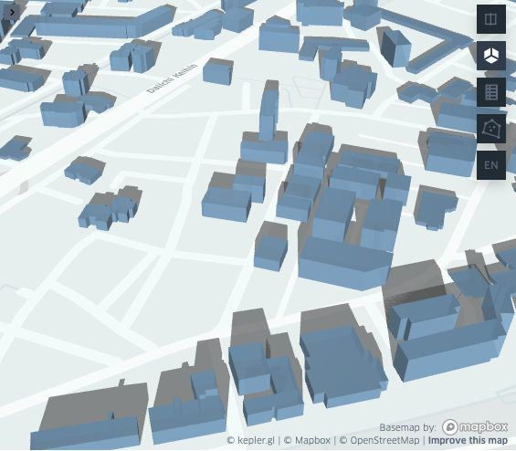

.. pybdshadow documentation master file, created by
   sphinx-quickstart on Thu Oct 21 14:41:25 2021.
   You can adapt this file completely to your liking, but it should at least
   contain the root `toctree` directive.

pybdshadow 
========================================

`pybdshadow` is a python package to calculate building shadow geometry from parallel light source (sunlight) or point light source (Advertisement). 

Example
---------------------------------

Given a building GeoDataFrame and UTC datetime, `pybdshadow` can calculate the building shadow based on the sun position obtained by `suncalc`

::

   import pybdshadow
   #Given UTC datetime
   date = pd.to_datetime('2015-01-01 02:45:33.959797119')
   #Calculate building shadow
   shadows = pybdshadow.bdshadow_sunlight(buildings,date)

`pybdshadow` also provide visualization method supported by keplergl. 

::

   # visualize buildings and shadows
   pybdshadow.show_bdshadow(buildings = buildings,shadows = shadows)

Citation information
---------------------------------

Citation information can be found at https://github.com/ni1o1/pybdshadow/blob/main/CITATION.cff.

.. toctree::
   :caption: Installation and dependencies
   :maxdepth: 2

   install.rst

.. toctree::
   :caption: Example
   :maxdepth: 2

   example/example.rst

.. toctree::
   :caption: Method
   :maxdepth: 2
   
   preprocess.rst
   bdshadow.rst
   Visualization.rst