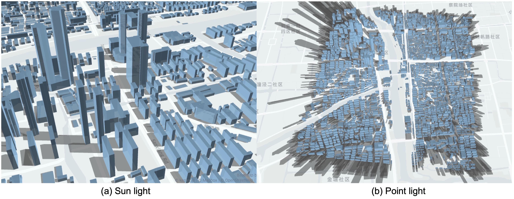

# Summary

Building shadows, as one of the significant elements in urban area, have an impact on a variety of features of the urban environment. Building shadows have been shown to affect local surface temperature in metropolitan environments, which will generate thermal influence to the greenery, water, and impervious structures on the urban heat island[@DAI201977-3; @PARK2021101655-4]. In the field of photovoltaic(PV), building integrated PV systems are expected to disseminate due to effective use of urban space. Researchers also focus on the power output performance affected by the shading of buildings[@WU2021116884-5]. Study of the spatial-temporal distribution of building shadow is conducive  in determining the best location for photovoltaic panels to maximize energy generation[@YADAV201811-6]. In addition, building shadows also play a significant role in the field of urban planning[@RAFIEE2014397-12], noise propagation[@bolin2020investigation-9], and post-disaster building rehabilitation[@rs13163297].

With the development of remote sensing, photogrammetry and deep learning technology, researchers are able to obtain city-scale building data with high resolution. These newly emerged building data provides an available data source for generating and analyzing building shadows[@CHEN2020114-8]. 

`pybdshadow` is a Python package to generate building shadows from building data and provide corresponding methods to analyze the changing position of shadows. `pybdshadow` can provide brand new and valuable data source for supporting the field of urban studies. 

# State of the art

Existing methods of generating and detecting building shadows can be devided into two major ways: Remote sensing and BIM/GIS analysis.

- Remote sensing: In the field of remote sensing and satellite image processing, researchers examine shadow information from remote sensing images by identifying and distinguishing building shadows from other objects[@rs13152862-7].
Zhou et al. developed a shadow detection method by combining the zero-crossing detection method with the DBM-based geometric method to identify shadow from high-resolution images[@zhou2015integrated-10; @rs12040679-11].
- BIM/GIS analysis: Another way of obtaining building shadow is to transform Building Information Model(BIM) to its corresponding geo-located model[@RAFIEE2014397-12]. The Hillshade function provided in ArcGIS is capable of producing a grayscale 3D representation of the terrain surface, which can be used as a tool for analysing building shadow. Hong et al. analyze the building shadow using Hillshade Analysis and estimate the available rooftop area for PV System[@HONG2016408-13]. Miranda et al. propose an approach that uses the properties of sun movement to track the changing position of shadows within a fixed time interval[@8283638-14].

In Python environment, geospatial analysing package like `geopandas`, `turfpy`, `PySAL` provide tools to easily implement the spatial analysis of spatial data. Nevertheless, there is a lack of an effective tool for generating and analyzing building shadows that is compatible with the Python data processing framework.

# Statement of need

pybdshadow is a python package for generating, analyzing and visualizing building shadows.

提供了平行光源与点光源的建筑阴影向量化计算方法，针对地理矢量建筑数据在不同光源类型及光源位置下的阴影分析及显示。实现数据处理、阴影计算、可视化的集成效果。

`pybdshadow` presents an important new source of geospatial network data
目前pybdshadow提供了以下功能：

- Preprocess:将用户输入的数据处理成所需要的geopandas格式。Building Data
- Calculation: 包括平行光源与点光源。平行光源：根据用户输入的经纬度及时间利用suncalc库计算太阳方位角及高度角，利用太阳角度信息推算阴影位置。点光源：用户输入一个三维坐标，计算在该点光源下的投影
- Analysis: 基于 `TransBigData` 提供了分析的功能[@Yu2022]
  (\autoref{fig:fig2})
- Visualization: Built-in visualization capabilities leverage the visualization package `keplergl` to interactively visualize data in Jupyter notebooks with simple code.(\autoref{fig:fig1})

The target audience of `pybdshadow` includes:

1. Data science researchers and data engineers in the field of xxx, xxx, and urban computing, particularly those who want to xxx;
2. Government, enterprises, or other entities who expect xxx management decision support through xxx spatio-temporal data analysis.

The latest stable release of the software can be installed via `pip` and full documentation can be found at https://pybdshadow.readthedocs.io/en/latest/.

{ width=100% }

{ width=100% }

# References

